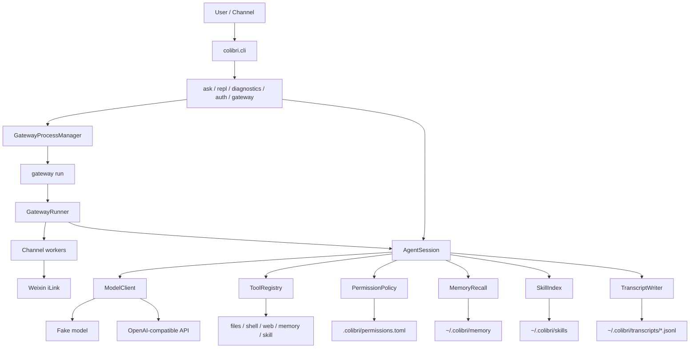

# Colibri

Lightweight Python agent runtime for CardputerZero-class Linux devices.

Colibri is designed to run as a small, headless agent on a Linux card server. It can be used from a local CLI, an SSH session, or a long-running gateway process that connects external chat channels such as Weixin.

[中文文档](README.zh-CN.md)

## Highlights

- Headless runtime: no browser, GUI, system tray, audio device, or TUI framework required.
- Standard-library runtime: third-party packages are only needed for development tests.
- OpenAI-compatible model adapter plus a deterministic fake model for tests.
- Bounded tool loop with dynamic permissions.
- Built-in tools for files, shell, memory, web search, and local skills.
- Markdown-backed persistent memory with bounded recall injection.
- Local skills with progressive disclosure.
- Context compacting with model summaries and deterministic fallback.
- JSONL transcripts for CLI and gateway sessions.
- Weixin gateway channel through Tencent iLink.
- Gateway process management: `run`, `start`, `stop`, `restart`, `status`.

## Architecture



## Install And Test

```bash
uv run python -m pytest
uv run python -m colibri.cli ask "hello"
uv run python -m colibri.cli repl
uv run python -m colibri.cli diagnostics
```

The runtime itself is standard-library only. `pytest` is used for development tests.

## Configuration

If `--config` is omitted, Colibri loads:

```text
~/.colibri/config.toml
```

If the file does not exist, built-in defaults are used. An explicit `--config` path always wins.

Example configs live in:

```text
configs/agent.example.toml
configs/openai.example.toml
configs/glm.example.toml
```

API keys should stay in private config files or environment variables. Do not commit private config files.

## Model Providers

The default provider is deterministic and local:

```bash
uv run python -m colibri.cli ask "hello"
```

For an OpenAI-compatible chat completions endpoint:

```toml
[model]
provider = "openai_compatible"
base_url = "https://your-openai-compatible-api.example/v1"
model = "your-model"
api_key = ""
```

`model.api_key` takes precedence. If it is empty, Colibri reads `COLIBRI_API_KEY`.

## CLI

```bash
uv run python -m colibri.cli ask "hello"
uv run python -m colibri.cli repl
uv run python -m colibri.cli diagnostics
uv run python -m colibri.cli auth weixin
```

`ask` runs one request and exits. `repl` keeps a multi-turn local session. `diagnostics` prints environment, paths, RSS, and context limits. `auth weixin` starts iLink QR login and writes the Weixin token to the active config file.

## Gateway

Gateway is the process entry for external chat channels.

```bash
uv run python -m colibri.cli gateway run
uv run python -m colibri.cli gateway start
uv run python -m colibri.cli gateway stop
uv run python -m colibri.cli gateway restart
uv run python -m colibri.cli gateway status
```

- `gateway run`: foreground runner for debugging or service managers.
- `gateway start`: background runner; returns immediately.
- `gateway stop`: stops the background gateway.
- `gateway restart`: stop then start.
- `gateway status`: prints process status, PID, RSS when available, config path, state path, and log path.

Background state and logs:

```text
~/.colibri/run/gateway.json
~/.colibri/logs/gateway.log
```

The bare `colibri gateway` command is only a command group and prints usage instead of blocking the terminal.

## Weixin Channel

Configure Weixin in private config:

```toml
[gateway]
enabled_channels = ["weixin"]
max_sessions = 4
session_idle_seconds = 600

[channels.weixin]
enabled = true
token = "..."
base_url = "https://ilinkai.weixin.qq.com/"
allow_from = []
```

Run QR auth:

```bash
uv run python -m colibri.cli auth weixin
```

Gateway keeps one bounded `AgentSession` per channel user, keyed like `weixin:<sender_id>`. Permission prompts are sent back through Weixin text and accept `y`, `s`, `e`, `p`, or `n`.

## Built-In Tools

When the model returns tool calls, Colibri can execute:

- `files.list`: list direct children under allowed roots.
- `files.read`: read UTF-8 text files under allowed roots.
- `shell.run`: run shell commands after permission approval.
- `web.search`: search the web through the configured provider.
- `memory.list`: list Markdown memory topics.
- `memory.read`: read a memory topic.
- `memory.search`: search memory index and topic files.
- `memory.write`: append a Markdown bullet to a memory topic.
- `skill.run`: run a configured local skill command.

Tool calls are bounded by `session.max_tool_rounds` and tool output is capped by `tools.max_result_chars`.

## Permissions

The default permission mode is:

```toml
[tools]
default_permission = "allow_read_confirm_write"
```

Read-only non-shell tools are allowed inside their normal safe boundaries. Shell commands and writes ask for confirmation unless already granted.

Prompt choices:

- `y`: allow once.
- `s`: allow for the current session.
- `e`: shell only, allow the same executable for the current session.
- `p`: allow for this project.
- `n`: deny.

Project grants are stored in:

```text
.colibri/permissions.toml
```

That project runtime directory is ignored by git.

## Memory

Persistent memory is Markdown-backed:

```text
~/.colibri/memory/
  MEMORY.md
  topics/
    devices.md
```

When `memory.enabled = true`, Colibri reads `MEMORY.md`, scores topics against the current turn, and injects the top relevant topic files as temporary model context. Memory injection is bounded by `memory.max_recall_topics` and `memory.max_recall_chars`.

## Local Skills

Skills live in configured directories such as:

```text
~/.colibri/skills/<name>/SKILL.md
```

Optional `skill.toml` files can declare commands for `skill.run`.

Colibri also ships the built-in `create-colibri-skill` guidance skill. Skill loading uses progressive disclosure: metadata is indexed first, and only selected skill instructions are read into a turn.

## Context And Memory Limits

Important defaults:

```toml
[model]
max_output_tokens = 16384
timeout_seconds = 60

[session]
max_tool_rounds = 32
trigger_message_limit = 96
recent_message_limit = 12
compact_trigger_chars = 192000
summary_max_chars = 12000
model_compact = true
transcript = true

[tools]
max_result_chars = 32000

[gateway]
max_sessions = 4
session_idle_seconds = 600
```

When the session reaches `trigger_message_limit` messages, Colibri compacts the current message buffer into a bounded rolling summary and keeps the latest `recent_message_limit` messages. Model input is trimmed to fit `compact_trigger_chars` while preserving the latest user message.

## Transcripts

When `session.transcript = true`, Colibri writes compact JSONL events to:

```text
~/.colibri/transcripts/YYYY-MM-DD.jsonl
```

CLI and gateway sessions both use transcript logging. Gateway transcript payloads include channel metadata such as `channel`, `sender_id`, and `session_key`.

## Console Status And Diagnostics

When `console.status = true`, concise status lines go to `stderr`:

```text
[colibri] ready model=fake-colibri-model
[colibri] thinking
[colibri] tool files.read ok chars=1284
```

Model answers stay on `stdout`.

Diagnostics:

```bash
uv run python -m colibri.cli diagnostics
```

## Systemd

An example service file is available:

```text
deploy/systemd/colibri-repl.service
```

For gateway deployments, use `gateway run` as the foreground command under a service manager.
