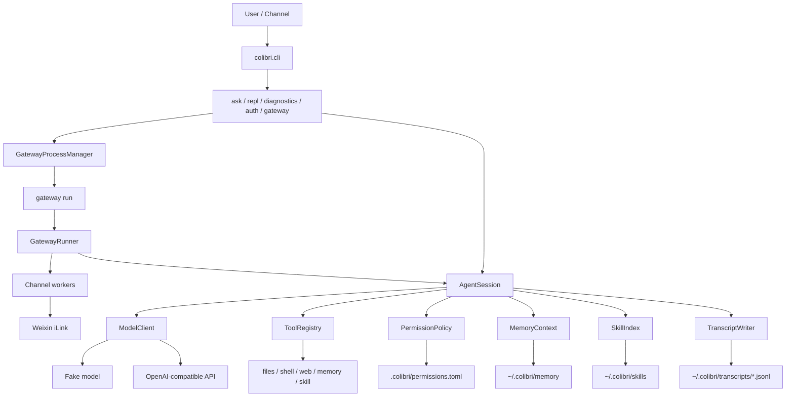

# Colibri

Lightweight Python agent runtime for CardputerZero-class Linux devices.

Colibri is designed to run as a small, headless agent on a Linux card server. It can be used from a local CLI, an SSH session, or a long-running gateway process that connects external chat channels such as Weixin.

[中文文档](README.zh-CN.md)

## Highlights

- Headless runtime: no browser, GUI, system tray, audio device, or TUI framework required.
- Standard-library runtime: third-party packages are only needed for development tests.
- OpenAI-compatible model adapter plus a deterministic fake model for tests.
- Bounded tool loop with dynamic permissions.
- Built-in tools for files, shell, memory, web search, and local skills.
- Markdown-backed persistent memory with bounded recall injection.
- Local skills with progressive disclosure.
- Context compacting with model summaries and deterministic fallback.
- JSONL transcripts for CLI and gateway sessions.
- Weixin gateway channel through Tencent iLink.
- Gateway process management: `run`, `start`, `stop`, `restart`, `status`.

## Architecture



## Install And Test

```bash
uv run python -m pytest
uv run python -m colibri.cli ask "hello"
uv run python -m colibri.cli repl
uv run python -m colibri.cli diagnostics
```

The runtime itself is standard-library only. `pytest` is used for development tests.

## Rust Port

A Cargo-based Rust port lives in `colibri-rust/`. Its target is configuration and behavior parity with the Python runtime while keeping memory use low. It uses focused crates such as `toml`, `serde_json`, and a blocking Rust HTTP client instead of a large async/network stack or external HTTP executable.

```bash
/opt/homebrew/bin/uv run python -m pytest
cargo test --manifest-path colibri-rust/Cargo.toml
cargo build --release --manifest-path colibri-rust/Cargo.toml
./colibri-rust/target/release/colibri ask "hello"
./colibri-rust/target/release/colibri diagnostics
./colibri-rust/target/release/colibri gateway status
```

If `--config` is omitted, the Rust binary follows the Python runtime and reads `~/.colibri/config.toml` when it exists; otherwise it uses the built-in fake model defaults. For an isolated local smoke test:

```bash
env HOME=/tmp/colibri-rust-smoke ./colibri-rust/target/release/colibri ask "hello"
```

Rust supports the local CLI runtime, fake model, OpenAI-compatible requests and tool-calling payloads through a Rust-native blocking HTTP client, markdown memory, transcripts, transcript restore, built-in local tools for files, file sending, shell, image understanding, memory, skills, and Baidu web search, plus Weixin QR auth/API, inbound and outbound Weixin media, and gateway process management. Config parsing uses the same TOML syntax as Python's `tomllib`, including `[vision]`, `[session]`, and nested `[channels.weixin]` sections. `shell.run` follows the Python behavior by parsing shell-like quoting into argv and running the executable directly instead of through `sh -c`. `files.send` returns the same media result shape and requires an active channel media sender. `image.understand` uses the same vision defaults and fake-model response path as Python. Weixin auth renders the same terminal-block QR format for supported payload sizes. Gateway foreground handling uses a bounded Weixin work queue, sender-scoped sessions, Weixin permission prompts, channel media sending, and oldest-session eviction at `gateway.max_sessions`. MCP is not exposed by the current Python runtime, so the Rust config surface also omits top-level MCP defaults.

The Rust test suite is derived from the Python unit suite. `colibri-rust/tests/parity.rs` scans every Python `tests/unit/test_*.py::test_*` function, requires an explicit Rust coverage mapping for each one, rejects partial parity entries, verifies mapped Rust tests exist, and directly compares Python/Rust CLI output for deterministic commands such as `ask`, `diagnostics`, and `gateway` usage. Runtime tests cover the matching Rust library behavior for config, tools, permissions, memory, transcript, transcript restore, models, gateway, web search, skills, vision, media sending, Weixin auth, Weixin media download/upload, and Weixin permission reply parsing.

The Rust session applies the same default safety boundary: read-only tools run automatically, `tools.default_permission = "deny"` rejects tool calls, `tools.default_permission = "allow"` allows them, and project grants in `.colibri/permissions.toml` are honored. File permissions support `~` expansion, out-of-root file subjects, and simple `shell.run` write-target detection for redirection or `tee` commands. CLI `ask` and `repl` use Python-compatible interactive permission prompts for once, session, executable-session, project, and deny choices.

## Configuration

If `--config` is omitted, Colibri loads:

```text
~/.colibri/config.toml
```

If the file does not exist, built-in defaults are used. An explicit `--config` path always wins.

Example configs live in:

```text
configs/agent.example.toml
configs/openai.example.toml
configs/glm.example.toml
```

API keys should stay in private config files or environment variables. Do not commit private config files.

## Model Providers

The default provider is deterministic and local:

```bash
uv run python -m colibri.cli ask "hello"
```

For an OpenAI-compatible chat completions endpoint:

```toml
[model]
provider = "openai_compatible"
base_url = "https://your-openai-compatible-api.example/v1"
model = "your-model"
api_key = ""
```

`model.api_key` takes precedence. If it is empty, Colibri reads `COLIBRI_API_KEY`.

## CLI

```bash
uv run python -m colibri.cli ask "hello"
uv run python -m colibri.cli repl
uv run python -m colibri.cli diagnostics
uv run python -m colibri.cli auth weixin
```

`ask` runs one request and exits. `repl` keeps a multi-turn local session. `diagnostics` prints environment, paths, RSS, and context limits. `auth weixin` starts iLink QR login and writes the Weixin token to the active config file.

## Gateway

Gateway is the process entry for external chat channels.

```bash
uv run python -m colibri.cli gateway run
uv run python -m colibri.cli gateway start
uv run python -m colibri.cli gateway stop
uv run python -m colibri.cli gateway restart
uv run python -m colibri.cli gateway status
```

- `gateway run`: foreground runner for debugging or service managers.
- `gateway start`: background runner; returns immediately.
- `gateway stop`: stops the background gateway.
- `gateway restart`: stop then start.
- `gateway status`: prints process status, PID, RSS when available, config path, state path, and log path.

Background state and logs:

```text
~/.colibri/run/gateway.json
~/.colibri/logs/gateway.log
```

The bare `colibri gateway` command is only a command group and prints usage instead of blocking the terminal.

## Weixin Channel

Configure Weixin in private config:

```toml
[gateway]
enabled_channels = ["weixin"]
max_sessions = 4
session_idle_seconds = 600

[channels.weixin]
enabled = true
token = "..."
base_url = "https://ilinkai.weixin.qq.com/"
allow_from = []
```

Run QR auth:

```bash
uv run python -m colibri.cli auth weixin
```

Gateway keeps one bounded `AgentSession` per channel user, keyed like `weixin:<sender_id>`. Permission prompts are sent back through Weixin text and accept `y`, `s`, `e`, `p`, or `n`.

## Built-In Tools

When the model returns tool calls, Colibri can execute:

- `files.list`: list direct children under allowed roots.
- `files.read`: read UTF-8 text files under allowed roots.
- `files.write`: write UTF-8 text files under allowed roots; generated artifacts should use this instead of shell redirection.
- `shell.run`: run commands after permission approval; do not use it to create or edit files.
- `web.search`: search the web through the configured provider.
- `memory.list`: list always-on memory files and topic files.
- `memory.read`: read `MEMORY.md`, `USER.md`, `INDEX.md`, or a topic file.
- `memory.search`: search `INDEX.md` manifest lines; read matching topic files separately.
- `memory.write`: append to or replace a memory file after permission approval.
- `skill.run`: run a configured local skill command.

Tool calls are bounded by `session.max_tool_rounds` and tool output is capped by `tools.max_result_chars`.

## Permissions

The default permission mode is:

```toml
[tools]
default_permission = "allow_read_confirm_write"
```

Read-only non-shell tools are allowed inside their normal safe boundaries. Shell commands and writes ask for confirmation unless already granted.

Prompt choices:

- `y`: allow once.
- `s`: allow for the current session.
- `e`: shell only, allow the same executable for the current session.
- `p`: allow for this project.
- `n`: deny.

Project grants are stored in:

```text
.colibri/permissions.toml
```

That project runtime directory is ignored by git.

## Memory

Persistent memory is Markdown-backed:

```text
~/.colibri/memory/
  MEMORY.md
  USER.md
  INDEX.md
  topics/
    system-info.md
    colibri-design.md
```

When `memory.enabled = true`, Colibri injects bounded always-on context from `MEMORY.md` and `USER.md`. Detailed memory lookup is model-driven: the model uses `memory.search` to search `INDEX.md`, then `memory.read` to inspect linked `topics/*.md` files when prior context is needed. Automatic injection is bounded by `memory.max_recall_chars`.

If the memory directory is missing or contains no files, Colibri bootstraps sample `MEMORY.md`, `USER.md`, `INDEX.md`, and `topics/sample.md` files on first memory load. Existing memory files are never overwritten.

Keep `USER.md` under 600 characters and `MEMORY.md` under 1800 characters. If a `memory.write` call leaves either file over its limit, the tool result asks the model to consolidate it and replace the file.

## Local Skills

Skills live in configured directories such as:

```text
~/.colibri/skills/<name>/SKILL.md
```

Optional `skill.toml` files can declare commands for `skill.run`.

Colibri also ships the built-in `create-colibri-skill` guidance skill. Skill loading uses progressive disclosure: metadata is indexed first, and only selected skill instructions are read into a turn.

## Context And Memory Limits

Important defaults:

```toml
[model]
max_output_tokens = 16384
timeout_seconds = 60

[session]
max_tool_rounds = 32
trigger_message_limit = 96
recent_message_limit = 12
model_input_char_limit = 192000
summary_max_chars = 12000
model_compact = true
transcript = true

[tools]
max_result_chars = 32000

[gateway]
max_sessions = 4
session_idle_seconds = 600
```

When the session reaches `trigger_message_limit` messages, Colibri compacts the current message buffer into a bounded rolling summary and keeps the latest `recent_message_limit` messages. Model input is trimmed to fit `model_input_char_limit` while preserving the latest user message.

## Transcripts

When `session.transcript = true`, Colibri writes compact JSONL events to:

```text
~/.colibri/transcripts/YYYY-MM-DD.jsonl
```

CLI and gateway sessions both use transcript logging. Gateway transcript payloads include channel metadata such as `channel`, `sender_id`, and `session_key`.

## Console Status And Diagnostics

When `console.status = true`, concise status lines go to `stderr`:

```text
[colibri] ready model=fake-colibri-model
[colibri] thinking
[colibri] tool files.read ok chars=1284
```

Model answers stay on `stdout`.

Diagnostics:

```bash
uv run python -m colibri.cli diagnostics
```

## Systemd

An example service file is available:

```text
deploy/systemd/colibri-repl.service
```

For gateway deployments, use `gateway run` as the foreground command under a service manager.
