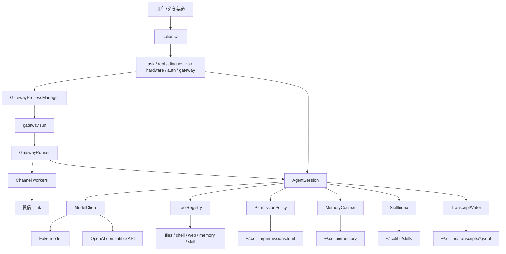

# Colibri

Colibri 是一个面向 CardputerZero 这类小内存 Linux 设备的轻量级 Python Agent 运行时。

它可以在无图形界面的服务器上运行，支持本地 CLI、SSH 会话，也支持通过 gateway 接入微信等外部聊天渠道。

[English README](README.md)

## 特性

- 纯命令行/SSH 友好，不依赖 GUI、浏览器、TUI、音频设备或桌面环境。
- 运行时只使用 Python 标准库，开发测试使用 `pytest`。
- 支持 OpenAI-compatible 模型接口，也内置确定性的 fake model 用于测试。
- 有边界的 agent tool loop。
- 内置文件、Shell、网页搜索、记忆、技能工具，以及默认关闭的只读硬件探测。
- 动态权限确认，使用数字选项，支持单次、session、可执行文件 session、用户级命令和用户级可执行文件授权。
- Markdown 文件记忆系统，支持自动 recall。
- 本地 skill，使用渐进式披露加载。
- 上下文压缩，支持模型摘要和本地 fallback。
- CLI 和 gateway 都支持 JSONL transcript。
- 微信 channel，基于腾讯 iLink。
- gateway 支持 `run/start/stop/restart/status`。

## 架构图



## 快速开始

```bash
uv run python -m pytest
uv run python -m colibri.cli ask "hello"
uv run python -m colibri.cli repl
uv run python -m colibri.cli diagnostics
```

如果不传 `--config`，Colibri 会读取：

```text
~/.colibri/config.toml
```

如果这个文件不存在，就使用内置默认配置。显式传入的 `--config` 优先级最高。

## Rust 复刻版

Cargo 版本位于 `colibri-rust/`，目标是和 Python 运行时保持配置项、配置方式和可观察行为一致，同时保持低内存依赖。Rust 版使用 `toml`、`serde_json`、`shell-words` 和同步 Rust HTTP 客户端这类聚焦的小型 crate；HTTP 相关能力不再调用外部命令，避免引入大型异步网络栈。

```bash
/opt/homebrew/bin/uv run python -m pytest
cargo test --manifest-path colibri-rust/Cargo.toml
cargo build --release --manifest-path colibri-rust/Cargo.toml
./colibri-rust/target/release/colibri ask "hello"
./colibri-rust/target/release/colibri diagnostics
```

Rust 版支持本地 CLI、fake model、OpenAI-compatible tool-calling payload、Markdown 记忆、transcript、transcript 恢复、文件发送、文件/Shell/图片理解/记忆/技能/Baidu 网页搜索、阿里云百炼托管 WebSearch MCP、微信 QR auth/API、微信入站/出站媒体和 gateway 进程管理，网络请求通过 Rust 原生同步 HTTP 客户端完成。配置解析使用和 Python `tomllib` 一致的 TOML 语义，包括 `[vision]`、`[session]` 和嵌套 `[channels.weixin]`。`shell.run` 和 Python 一样会把 shell 风格引号解析成 argv 后直接执行程序，不通过 `sh -c`。`files.send` 返回和 Python 相同的媒体结果，并要求当前 session 有可用的 channel media sender。`image.understand` 使用与 Python 一致的视觉默认值和 fake-model 行为。微信 auth 会为支持的 payload 渲染同样的终端块状 QR。Gateway 前台处理使用有界 Weixin work queue、按 sender 维护独立 session、通过微信回传权限确认、绑定 channel media sender，并在超过 `gateway.max_sessions` 时淘汰最旧 session。托管 MCP 集成仅作为现有 `web.search` 工具的一个后端，不增加通用的顶层 MCP 运行时。

Rust 测试集基于 Python 全量 unit 测试集建立覆盖映射。`colibri-rust/tests/parity.rs` 会扫描每个 Python `tests/unit/test_*.py::test_*` 函数，要求每个函数都有明确 Rust 覆盖映射，拒绝 `partial` 覆盖项，校验映射到的 Rust 测试真实存在，并直接对比 Python/Rust CLI 在 `ask`、`diagnostics`、`gateway` usage 等确定性命令上的退出码、stdout、stderr。Rust runtime 测试覆盖配置、工具、权限、记忆、transcript、transcript 恢复、模型、gateway、网页搜索、技能、视觉、媒体发送、微信 auth、微信媒体下载/上传和微信权限回复解析的等价行为。

Rust 权限边界和 Python 保持一致：只读工具默认允许，`tools.default_permission = "deny"` 拒绝工具调用，`tools.default_permission = "allow"` 允许工具调用，并读取 `~/.colibri/permissions.toml` 中的用户级授权。文件权限支持 `~` 展开、工作区外文件主体，以及对简单 `shell.run` 重定向或 `tee` 写入目标的识别。CLI `ask`、`repl` 和微信通道使用数字权限选项：`1` 单次、`2` session、`3` shell session 可执行文件、`4` 用户级、`5` shell 用户级可执行文件、`0` 拒绝。

示例配置在：

```text
configs/agent.example.toml
configs/openai.example.toml
configs/glm.example.toml
```

私密 API key 应保存在用户自己的配置文件或环境变量中，不要提交到仓库。

## 模型配置

默认模型是本地 fake model，适合测试：

```bash
uv run python -m colibri.cli ask "hello"
```

OpenAI-compatible 接口示例：

```toml
[model]
provider = "openai_compatible"
base_url = "https://your-openai-compatible-api.example/v1"
model = "your-model"
api_key = ""
```

`model.api_key` 优先。如果为空，Colibri 会读取 `COLIBRI_API_KEY`。

## 网页搜索

`web.search` 默认仍使用百度后端。切换到阿里云百炼托管的 WebSearch MCP：

```toml
[web_search]
engine = "aliyun_mcp"
endpoint = "https://dashscope.aliyuncs.com/api/v1/mcps/WebSearch/mcp"
api_key = ""
max_results = 10
timeout_seconds = 10
```

`web_search.api_key` 优先；为空时读取 `DASHSCOPE_API_KEY`。这是托管的 Streamable HTTP MCP 地址：Colibri 每次搜索通过 HTTPS 完成 MCP 生命周期，不会在本机启动 MCP 服务进程。现有 `[web_search]` 热加载逻辑同样适用。

## CLI 命令

```bash
uv run python -m colibri.cli ask "hello"
uv run python -m colibri.cli repl
uv run python -m colibri.cli diagnostics
uv run python -m colibri.cli hardware probe
uv run python -m colibri.cli hardware simulate
uv run python -m colibri.cli auth weixin
```

- `ask`：执行一次请求后退出。
- `repl`：本地多轮对话。长任务执行中，TTY 下可直接输入一行新指令**改方向**（跳过剩余工具并注入文本），无需等 `colibri>` 提示符；权限确认期间不可用。
- `diagnostics`：查看环境、路径、RSS、上下文限制等诊断信息。
- `hardware probe`：列出主机标准硬件设备节点，不打开设备，也不启动后台监听。
- `hardware simulate`：以前台 stdin/stdout NDJSON 方式运行 GPIO/I2C/SPI 协议模拟器，供无真机开发和测试使用。
- `auth weixin`：启动微信 iLink 二维码登录，并把 token 写入当前配置文件。

要向模型暴露硬件工具，需要同时打开两个开关，并显式配置设备白名单：

```toml
[tools]
enabled = ["shell", "files", "web", "image", "memory", "skills", "hardware"]

[hardware]
enabled = true
discovery = "on_demand"
operation_timeout_seconds = 2.0
max_transfer_bytes = 4096

[[hardware.devices]]
name = "controller"
path = "/dev/ttyACM0"
transport = "serial_json"
baud_rate = 115200
capabilities = ["serial", "gpio", "i2c", "spi"]
allow_write = false
```

模型只能使用 `name` 别名，不能提交任意设备路径。当前工具包括 `hardware.probe`、`hardware.devices`、`serial.read/write`、`gpio.read/write`、`i2c.scan/read/write` 和 `spi.transfer`。GPIO/I2C/SPI 通过有界的 newline-delimited JSON 串口控制器协议执行；原生 Linux 总线驱动留到真机接口确认后接入。

带副作用的操作必须同时满足 `allow_write = true` 和权限确认。硬件权限按设备提供 `once`、`session-device`、`user-device`、`deny`，持久授权写入 `permissions.toml` 的 `[hardware].devices`。任何授权都不能绕过设备白名单、能力、超时和传输大小限制。所有设备均按操作打开并立即关闭，不常驻扫描或持有设备句柄。

## Gateway

Gateway 用于接入外部聊天渠道：

```bash
uv run python -m colibri.cli gateway run
uv run python -m colibri.cli gateway start
uv run python -m colibri.cli gateway stop
uv run python -m colibri.cli gateway restart
uv run python -m colibri.cli gateway status
```

- `gateway run`：前台运行，适合调试或 systemd/supervisor 托管。
- `gateway start`：后台启动，命令立即返回。
- `gateway stop`：停止后台 gateway。
- `gateway restart`：重启后台 gateway。
- `gateway status`：查看运行状态、PID、RSS、配置路径、日志路径等。
- `gateway status` 还会显示 `agent_status=healthy|unhealthy`；进程是否运行与 Agent 是否健康相互独立。
- 运行中的 Gateway 和 REPL 会在下一轮对话前热加载配置中的 `[model]`、`[vision]`、`[web_search]`。无效修改会被拒绝并继续使用上一份可用配置；其他配置项需要重启后生效。

后台状态和日志：

```text
~/.colibri/run/gateway.json
~/.colibri/logs/gateway.log
```

裸命令 `colibri gateway` 不再启动阻塞服务，只显示可用动作。

## 微信 Channel

私有配置示例：

```toml
[gateway]
enabled_channels = ["weixin"]
max_sessions = 4
session_idle_seconds = 600
max_pending_inbound = 8
max_concurrent_turns = 1

[channels.weixin]
enabled = true
token = "..."
base_url = "https://ilinkai.weixin.qq.com/"
allow_from = []
```

登录：

```bash
uv run python -m colibri.cli auth weixin
```

Gateway 会按微信用户维护独立的 `AgentSession`，key 类似：

```text
weixin:<sender_id>
```

工具权限确认会通过微信文本发给用户，使用数字回复。

工具执行过程中，同一用户再发一条消息可**改方向**：跳过剩余工具并注入新指令，Colibri 会立即回复简短中文确认（如 `已改方向，跳过剩余 N 个工具`）。权限确认期间不可用。

## 内置工具

- `files.list`：列出允许目录下的直接子项。
- `files.read`：读取允许目录下的 UTF-8 文本文件。
- `shell.run`：经权限确认后执行 shell 命令。
- `web.search`：通过配置的搜索引擎搜索网页。
- `memory.list`：列出 always-on 记忆文件和 topic 文件。
- `memory.read`：读取 `SOUL.md`、`USER.md`、`MEMORY.md`、`INDEX.md` 或 topic 文件。
- `memory.search`：搜索 `INDEX.md` 目录行；详细 topic 需要再单独读取。
- `memory.write`：经权限确认后追加或替换记忆文件。
- `skill.read`：按 catalog 中的 name 读取完整 `SKILL.md`。
- `skill.run`：运行本地 skill 中配置的命令。

工具调用受 `session.max_tool_rounds` 限制，工具输出受 `tools.max_result_chars` 限制。

## 权限

默认权限策略：

```toml
[tools]
default_permission = "allow_read_confirm_write"
```

安全边界内的只读非 shell 工具默认允许。Shell 命令和写操作默认询问。

确认选项：

- `1`：只允许本次。
- `2`：当前 session 允许。
- `3`：仅 shell，有效于当前 session 的同一可执行文件。
- `4`：用户级长期允许。
- `5`：仅 shell，用户级长期允许同一可执行文件。
- `0`：拒绝。

用户级授权存储在：

```text
~/.colibri/permissions.toml
```

## 记忆

持久记忆是 Markdown 文件：

```text
~/.colibri/memory/
  SOUL.md
  USER.md
  MEMORY.md
  INDEX.md
  topics/
    system-info.md
    colibri-design.md
```

当 `memory.enabled = true` 时，Colibri 会把 `SOUL.md`、`USER.md` 和 `MEMORY.md` 作为有界 always-on 上下文注入模型。详细记忆检索交给模型判断：模型先用 `memory.search` 搜索 `INDEX.md`，再用 `memory.read` 读取关联的 `topics/*.md` 文件。自动注入受 `memory.max_recall_chars` 限制。

如果 memory 目录不存在，或目录中没有任何文件，Colibri 会在首次加载 memory 时创建样例 `SOUL.md`、`USER.md`、`MEMORY.md`、`INDEX.md` 和 `topics/sample.md`。已有 memory 文件不会被覆盖。

`SOUL.md` 应控制在 400 字符以内，`USER.md` 应控制在 400 字符以内，`MEMORY.md` 应控制在 1200 字符以内。如果某次 `memory.write` 写入后导致文件超限，工具结果会提醒模型合并整理，并用 `mode="replace"` 重写。

## 本地 Skills

Skills 统一放在单一目录：

```text
~/.colibri/skills/<name>/SKILL.md
~/.colibri/skills/<name>/scripts/...  # 可选
```

每个 `SKILL.md` 都必须以 YAML frontmatter 开头，其中的 name 必须与目录名一致：

```markdown
---
name: example
description: 当用户需要示例工作流时使用。
commands:
  - name: check
    description: 运行本地检查。
    command: python
    args: [scripts/check.py]
    read_only: true
---

# Example Skill
```

每轮只注入有界 skill catalog（name / description / command names / path）。模型需要完整说明时调用 `skill.read`；当已配置的 command 与用户请求匹配时，应使用 `skill.run`，而不是通过 `shell.run` 直接执行底层命令。

内置 `create-colibri-skill` 仍是指导 skill，不从磁盘扫描。

## 模型网络恢复

临时模型故障（网络/DNS 错误、超时、HTTP 408/429 和 5xx）会进行有界指数退避重试。默认重试两次，等待 500ms 和 1000ms：

```toml
[model]
max_retries = 2
retry_backoff_ms = 500
```

重试耗尽后只结束当前 turn。REPL 会重新显示提示符，gateway session 仍可处理后续消息。Channel adapter 只负责传输，不包含模型重试策略。

## 上下文与内存相关默认值

```toml
[model]
max_output_tokens = 16384
timeout_seconds = 60
input_context_tokens = 48000
max_retries = 2
retry_backoff_ms = 500

[session]
max_tool_rounds = 32
trigger_message_limit = 96
recent_message_limit = 12
summary_max_chars = 12000
model_compact = true
transcript = true

[tools]
max_result_chars = 32000

[gateway]
max_sessions = 4
session_idle_seconds = 600
max_pending_inbound = 8
max_concurrent_turns = 1
```

当 session 达到 `trigger_message_limit` 条消息，或估算模型输入 token 达到 `model.input_context_tokens` 的 80% 时，Colibri 会把当前消息缓冲压缩进滚动摘要，并保留最近 `recent_message_limit` 条消息。如果运行时没有 tokenizer，则按 UTF-8 字节数除以 4 估算 token。它不会再额外通过裁剪旧消息来控制输入大小。

## Transcript

当 `session.transcript = true` 时，Colibri 写入 JSONL：

```text
~/.colibri/transcripts/YYYY-MM-DD.jsonl
```

CLI 和 gateway session 都会写 transcript。Gateway 事件会额外包含 `channel`、`sender_id`、`session_key` 等 metadata。

## 状态与诊断

当 `console.status = true` 时，状态行写到 `stderr`：

```text
[colibri] ready model=fake-colibri-model
[colibri] thinking
[colibri] tool files.read ok chars=1284
```

模型回答保留在 `stdout`。默认 `console.plain_answer = true`，会对本地 `ask`/`repl` 的最终回答做小屏友好去噪（去掉粗体/代码标记、表格改成普通行）；设为 `false` 可恢复原始 markdown。微信 gateway 发出的消息不受影响。

诊断命令：

```bash
uv run python -m colibri.cli diagnostics
```

## Systemd

示例服务文件：

```text
deploy/systemd/colibri-repl.service
deploy/systemd/colibri-gateway.service
```

Gateway 开机自启用 `colibri-gateway.service`：前台执行 `gateway run`（不要用 `gateway start`）。  
微信 channel 不监听本地端口，只要设备能出网访问微信 API，且 `channels.weixin` 已配置 token，即可在 systemd 下正常收发。
