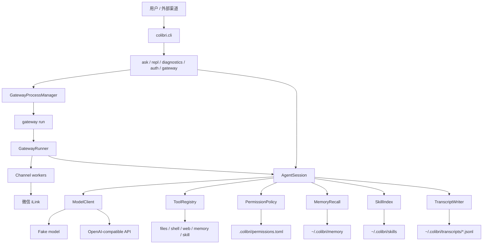

# Colibri

Colibri 是一个面向 CardputerZero 这类小内存 Linux 设备的轻量级 Python Agent 运行时。

它可以在无图形界面的服务器上运行，支持本地 CLI、SSH 会话，也支持通过 gateway 接入微信等外部聊天渠道。

[English README](README.md)

## 特性

- 纯命令行/SSH 友好，不依赖 GUI、浏览器、TUI、音频设备或桌面环境。
- 运行时只使用 Python 标准库，开发测试使用 `pytest`。
- 支持 OpenAI-compatible 模型接口，也内置确定性的 fake model 用于测试。
- 有边界的 agent tool loop。
- 内置文件、Shell、网页搜索、记忆、技能工具。
- 动态权限确认，支持单次、session、可执行文件 session、项目级授权。
- Markdown 文件记忆系统，支持自动 recall。
- 本地 skill，使用渐进式披露加载。
- 上下文压缩，支持模型摘要和本地 fallback。
- CLI 和 gateway 都支持 JSONL transcript。
- 微信 channel，基于腾讯 iLink。
- gateway 支持 `run/start/stop/restart/status`。

## 架构图



## 快速开始

```bash
uv run python -m pytest
uv run python -m colibri.cli ask "hello"
uv run python -m colibri.cli repl
uv run python -m colibri.cli diagnostics
```

如果不传 `--config`，Colibri 会读取：

```text
~/.colibri/config.toml
```

如果这个文件不存在，就使用内置默认配置。显式传入的 `--config` 优先级最高。

示例配置在：

```text
configs/agent.example.toml
configs/openai.example.toml
configs/glm.example.toml
```

私密 API key 应保存在用户自己的配置文件或环境变量中，不要提交到仓库。

## 模型配置

默认模型是本地 fake model，适合测试：

```bash
uv run python -m colibri.cli ask "hello"
```

OpenAI-compatible 接口示例：

```toml
[model]
provider = "openai_compatible"
base_url = "https://your-openai-compatible-api.example/v1"
model = "your-model"
api_key = ""
```

`model.api_key` 优先。如果为空，Colibri 会读取 `COLIBRI_API_KEY`。

## CLI 命令

```bash
uv run python -m colibri.cli ask "hello"
uv run python -m colibri.cli repl
uv run python -m colibri.cli diagnostics
uv run python -m colibri.cli auth weixin
```

- `ask`：执行一次请求后退出。
- `repl`：本地多轮对话。
- `diagnostics`：查看环境、路径、RSS、上下文限制等诊断信息。
- `auth weixin`：启动微信 iLink 二维码登录，并把 token 写入当前配置文件。

## Gateway

Gateway 用于接入外部聊天渠道：

```bash
uv run python -m colibri.cli gateway run
uv run python -m colibri.cli gateway start
uv run python -m colibri.cli gateway stop
uv run python -m colibri.cli gateway restart
uv run python -m colibri.cli gateway status
```

- `gateway run`：前台运行，适合调试或 systemd/supervisor 托管。
- `gateway start`：后台启动，命令立即返回。
- `gateway stop`：停止后台 gateway。
- `gateway restart`：重启后台 gateway。
- `gateway status`：查看运行状态、PID、RSS、配置路径、日志路径等。

后台状态和日志：

```text
~/.colibri/run/gateway.json
~/.colibri/logs/gateway.log
```

裸命令 `colibri gateway` 不再启动阻塞服务，只显示可用动作。

## 微信 Channel

私有配置示例：

```toml
[gateway]
enabled_channels = ["weixin"]
max_sessions = 4
session_idle_seconds = 600

[channels.weixin]
enabled = true
token = "..."
base_url = "https://ilinkai.weixin.qq.com/"
allow_from = []
```

登录：

```bash
uv run python -m colibri.cli auth weixin
```

Gateway 会按微信用户维护独立的 `AgentSession`，key 类似：

```text
weixin:<sender_id>
```

工具权限确认会通过微信文本发给用户，可回复 `y`、`s`、`e`、`p`、`n`。

## 内置工具

- `files.list`：列出允许目录下的直接子项。
- `files.read`：读取允许目录下的 UTF-8 文本文件。
- `shell.run`：经权限确认后执行 shell 命令。
- `web.search`：通过配置的搜索引擎搜索网页。
- `memory.list`：列出记忆 topic。
- `memory.read`：读取记忆 topic。
- `memory.search`：搜索记忆索引和 topic 文件。
- `memory.write`：向记忆 topic 追加 Markdown bullet。
- `skill.run`：运行本地 skill 中配置的命令。

工具调用受 `session.max_tool_rounds` 限制，工具输出受 `tools.max_result_chars` 限制。

## 权限

默认权限策略：

```toml
[tools]
default_permission = "allow_read_confirm_write"
```

安全边界内的只读非 shell 工具默认允许。Shell 命令和写操作默认询问。

确认选项：

- `y`：只允许本次。
- `s`：当前 session 允许。
- `e`：仅 shell，有效于当前 session 的同一可执行文件。
- `p`：项目级允许。
- `n`：拒绝。

项目级授权存储在：

```text
.colibri/permissions.toml
```

这个本地运行目录已加入 `.gitignore`。

## 记忆

持久记忆是 Markdown 文件：

```text
~/.colibri/memory/
  MEMORY.md
  topics/
    devices.md
```

当 `memory.enabled = true` 时，Colibri 会读取 `MEMORY.md`，根据当前问题选择相关 topic，把内容作为临时上下文注入模型。注入受 `memory.max_recall_topics` 和 `memory.max_recall_chars` 限制。

## 本地 Skills

Skills 位于：

```text
~/.colibri/skills/<name>/SKILL.md
```

可选的 `skill.toml` 可以声明 `skill.run` 可执行的本地命令。

Colibri 内置 `create-colibri-skill` 指导 skill。Skill 加载采用渐进式披露：先索引 metadata，每轮只读取被选中的 skill 指令。

## 上下文与内存相关默认值

```toml
[model]
max_output_tokens = 16384
timeout_seconds = 60

[session]
max_tool_rounds = 32
recent_message_limit = 96
compact_trigger_chars = 24000
summary_max_chars = 24000
model_compact = true
transcript = true

[tools]
max_result_chars = 32000

[gateway]
max_sessions = 4
session_idle_seconds = 600
```

超过 `recent_message_limit` 的旧消息会被压缩进滚动摘要。模型输入会按 `compact_trigger_chars` 裁剪，同时保留最新用户消息。

## Transcript

当 `session.transcript = true` 时，Colibri 写入 JSONL：

```text
~/.colibri/transcripts/YYYY-MM-DD.jsonl
```

CLI 和 gateway session 都会写 transcript。Gateway 事件会额外包含 `channel`、`sender_id`、`session_key` 等 metadata。

## 状态与诊断

当 `console.status = true` 时，状态行写到 `stderr`：

```text
[colibri] ready model=fake-colibri-model
[colibri] thinking
[colibri] tool files.read ok chars=1284
```

模型回答保留在 `stdout`。

诊断命令：

```bash
uv run python -m colibri.cli diagnostics
```

## Systemd

示例服务文件：

```text
deploy/systemd/colibri-repl.service
```

Gateway 服务化部署时，建议让服务管理器执行前台命令 `gateway run`。
