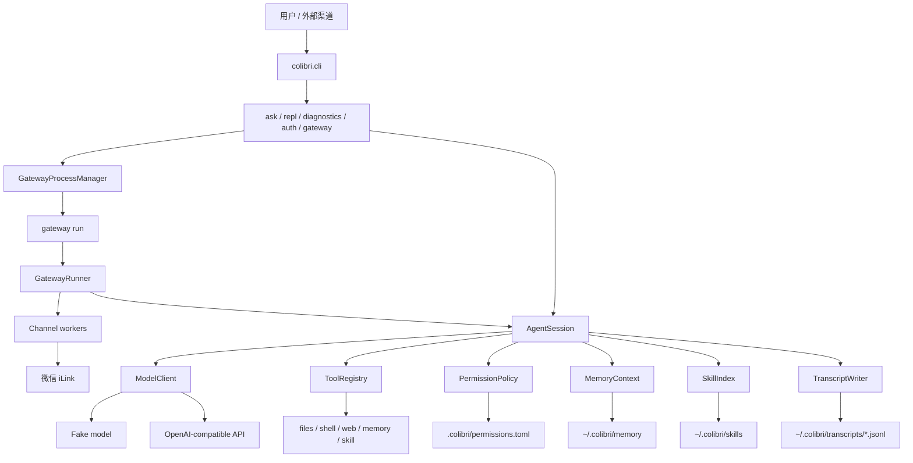

# Colibri

Colibri 是一个面向 CardputerZero 这类小内存 Linux 设备的轻量级 Python Agent 运行时。

它可以在无图形界面的服务器上运行，支持本地 CLI、SSH 会话，也支持通过 gateway 接入微信等外部聊天渠道。

[English README](README.md)

## 特性

- 纯命令行/SSH 友好，不依赖 GUI、浏览器、TUI、音频设备或桌面环境。
- 运行时只使用 Python 标准库，开发测试使用 `pytest`。
- 支持 OpenAI-compatible 模型接口，也内置确定性的 fake model 用于测试。
- 有边界的 agent tool loop。
- 内置文件、Shell、网页搜索、记忆、技能工具。
- 动态权限确认，支持单次、session、可执行文件 session、项目级授权。
- Markdown 文件记忆系统，支持自动 recall。
- 本地 skill，使用渐进式披露加载。
- 上下文压缩，支持模型摘要和本地 fallback。
- CLI 和 gateway 都支持 JSONL transcript。
- 微信 channel，基于腾讯 iLink。
- gateway 支持 `run/start/stop/restart/status`。

## 架构图



## 快速开始

```bash
uv run python -m pytest
uv run python -m colibri.cli ask "hello"
uv run python -m colibri.cli repl
uv run python -m colibri.cli diagnostics
```

如果不传 `--config`，Colibri 会读取：

```text
~/.colibri/config.toml
```

如果这个文件不存在，就使用内置默认配置。显式传入的 `--config` 优先级最高。

## Rust 复刻版

Cargo 版本位于 `colibri-rust/`，目标是和 Python 运行时保持配置项、配置方式和可观察行为一致，同时保持低内存依赖。Rust 版使用 `toml`、`serde_json`、`shell-words` 这类聚焦的小型 crate；HTTP 相关能力继续调用系统 `curl`，避免引入大型异步网络栈。

```bash
/opt/homebrew/bin/uv run python -m pytest
cargo test --manifest-path colibri-rust/Cargo.toml
cargo build --release --manifest-path colibri-rust/Cargo.toml
./colibri-rust/target/release/colibri-rust ask "hello"
./colibri-rust/target/release/colibri-rust diagnostics
```

Rust 版支持本地 CLI、fake model、OpenAI-compatible tool-calling payload、Markdown 记忆、transcript、文件/Shell/记忆/技能/Baidu 网页搜索工具、微信 QR auth/API 和 gateway 进程管理。配置解析使用和 Python `tomllib` 一致的 TOML 语义，包括嵌套 `[channels.weixin]`。`shell.run` 和 Python 一样会把 shell 风格引号解析成 argv 后直接执行程序，不通过 `sh -c`。微信 auth 会为支持的 payload 渲染同样的终端块状 QR。Gateway 前台处理会按 sender 维护独立 session，并在超过 `gateway.max_sessions` 时淘汰最旧 session。MCP 仍是延期里程碑，当前 Python 运行时不暴露 MCP 配置或工具。

Rust 测试集基于 Python 全量 unit 测试集建立覆盖映射。`colibri-rust/tests/parity.rs` 会列出每个 Python `tests/unit/test_*.py` 文件对应的 Rust 覆盖，并直接对比 Python/Rust CLI 在 `ask`、`diagnostics`、`gateway` usage 等确定性命令上的退出码、stdout、stderr。Rust runtime 测试覆盖配置、工具、权限、记忆、transcript、模型、gateway、网页搜索、技能和微信 auth 的等价行为。

Rust 权限边界和 Python 保持一致：只读工具默认允许，`tools.default_permission = "deny"` 拒绝工具调用，`tools.default_permission = "allow"` 允许工具调用，并读取 `.colibri/permissions.toml` 中的项目授权。文件权限支持 `~` 展开、工作区外文件主体，以及对简单 `shell.run` 重定向或 `tee` 写入目标的识别。CLI `ask` 和 `repl` 使用与 Python 兼容的交互式权限提示，支持单次、session、可执行文件 session、项目级和拒绝选择。

示例配置在：

```text
configs/agent.example.toml
configs/openai.example.toml
configs/glm.example.toml
```

私密 API key 应保存在用户自己的配置文件或环境变量中，不要提交到仓库。

## 模型配置

默认模型是本地 fake model，适合测试：

```bash
uv run python -m colibri.cli ask "hello"
```

OpenAI-compatible 接口示例：

```toml
[model]
provider = "openai_compatible"
base_url = "https://your-openai-compatible-api.example/v1"
model = "your-model"
api_key = ""
```

`model.api_key` 优先。如果为空，Colibri 会读取 `COLIBRI_API_KEY`。

## CLI 命令

```bash
uv run python -m colibri.cli ask "hello"
uv run python -m colibri.cli repl
uv run python -m colibri.cli diagnostics
uv run python -m colibri.cli auth weixin
```

- `ask`：执行一次请求后退出。
- `repl`：本地多轮对话。
- `diagnostics`：查看环境、路径、RSS、上下文限制等诊断信息。
- `auth weixin`：启动微信 iLink 二维码登录，并把 token 写入当前配置文件。

## Gateway

Gateway 用于接入外部聊天渠道：

```bash
uv run python -m colibri.cli gateway run
uv run python -m colibri.cli gateway start
uv run python -m colibri.cli gateway stop
uv run python -m colibri.cli gateway restart
uv run python -m colibri.cli gateway status
```

- `gateway run`：前台运行，适合调试或 systemd/supervisor 托管。
- `gateway start`：后台启动，命令立即返回。
- `gateway stop`：停止后台 gateway。
- `gateway restart`：重启后台 gateway。
- `gateway status`：查看运行状态、PID、RSS、配置路径、日志路径等。

后台状态和日志：

```text
~/.colibri/run/gateway.json
~/.colibri/logs/gateway.log
```

裸命令 `colibri gateway` 不再启动阻塞服务，只显示可用动作。

## 微信 Channel

私有配置示例：

```toml
[gateway]
enabled_channels = ["weixin"]
max_sessions = 4
session_idle_seconds = 600

[channels.weixin]
enabled = true
token = "..."
base_url = "https://ilinkai.weixin.qq.com/"
allow_from = []
```

登录：

```bash
uv run python -m colibri.cli auth weixin
```

Gateway 会按微信用户维护独立的 `AgentSession`，key 类似：

```text
weixin:<sender_id>
```

工具权限确认会通过微信文本发给用户，可回复 `y`、`s`、`e`、`p`、`n`。

## 内置工具

- `files.list`：列出允许目录下的直接子项。
- `files.read`：读取允许目录下的 UTF-8 文本文件。
- `shell.run`：经权限确认后执行 shell 命令。
- `web.search`：通过配置的搜索引擎搜索网页。
- `memory.list`：列出 always-on 记忆文件和 topic 文件。
- `memory.read`：读取 `MEMORY.md`、`USER.md`、`INDEX.md` 或 topic 文件。
- `memory.search`：搜索 `INDEX.md` 目录行；详细 topic 需要再单独读取。
- `memory.write`：经权限确认后追加或替换记忆文件。
- `skill.run`：运行本地 skill 中配置的命令。

工具调用受 `session.max_tool_rounds` 限制，工具输出受 `tools.max_result_chars` 限制。

## 权限

默认权限策略：

```toml
[tools]
default_permission = "allow_read_confirm_write"
```

安全边界内的只读非 shell 工具默认允许。Shell 命令和写操作默认询问。

确认选项：

- `y`：只允许本次。
- `s`：当前 session 允许。
- `e`：仅 shell，有效于当前 session 的同一可执行文件。
- `p`：项目级允许。
- `n`：拒绝。

项目级授权存储在：

```text
.colibri/permissions.toml
```

这个本地运行目录已加入 `.gitignore`。

## 记忆

持久记忆是 Markdown 文件：

```text
~/.colibri/memory/
  MEMORY.md
  USER.md
  INDEX.md
  topics/
    system-info.md
    colibri-design.md
```

当 `memory.enabled = true` 时，Colibri 会把 `MEMORY.md` 和 `USER.md` 作为有界 always-on 上下文注入模型。详细记忆检索交给模型判断：模型先用 `memory.search` 搜索 `INDEX.md`，再用 `memory.read` 读取关联的 `topics/*.md` 文件。自动注入受 `memory.max_recall_chars` 限制。

如果 memory 目录不存在，或目录中没有任何文件，Colibri 会在首次加载 memory 时创建样例 `MEMORY.md`、`USER.md`、`INDEX.md` 和 `topics/sample.md`。已有 memory 文件不会被覆盖。

`USER.md` 应控制在 600 字符以内，`MEMORY.md` 应控制在 1800 字符以内。如果某次 `memory.write` 写入后导致文件超限，工具结果会提醒模型合并整理，并用 `mode="replace"` 重写。

## 本地 Skills

Skills 位于：

```text
~/.colibri/skills/<name>/SKILL.md
```

可选的 `skill.toml` 可以声明 `skill.run` 可执行的本地命令。

Colibri 内置 `create-colibri-skill` 指导 skill。Skill 加载采用渐进式披露：先索引 metadata，每轮只读取被选中的 skill 指令。

## 上下文与内存相关默认值

```toml
[model]
max_output_tokens = 16384
timeout_seconds = 60

[session]
max_tool_rounds = 32
trigger_message_limit = 96
recent_message_limit = 12
model_input_char_limit = 192000
summary_max_chars = 12000
model_compact = true
transcript = true

[tools]
max_result_chars = 32000

[gateway]
max_sessions = 4
session_idle_seconds = 600
```

当 session 达到 `trigger_message_limit` 条消息时，Colibri 会把当前消息缓冲压缩进滚动摘要，并保留最近 `recent_message_limit` 条消息。模型输入会按 `model_input_char_limit` 裁剪，同时保留最新用户消息。

## Transcript

当 `session.transcript = true` 时，Colibri 写入 JSONL：

```text
~/.colibri/transcripts/YYYY-MM-DD.jsonl
```

CLI 和 gateway session 都会写 transcript。Gateway 事件会额外包含 `channel`、`sender_id`、`session_key` 等 metadata。

## 状态与诊断

当 `console.status = true` 时，状态行写到 `stderr`：

```text
[colibri] ready model=fake-colibri-model
[colibri] thinking
[colibri] tool files.read ok chars=1284
```

模型回答保留在 `stdout`。

诊断命令：

```bash
uv run python -m colibri.cli diagnostics
```

## Systemd

示例服务文件：

```text
deploy/systemd/colibri-repl.service
```

Gateway 服务化部署时，建议让服务管理器执行前台命令 `gateway run`。
