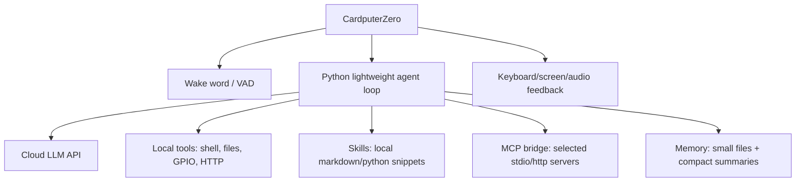

# CardputerZero 信息总结

日期：2026-07-01  
资料来源：M5Stack 官方页面/新闻稿、Hackster、Root.cz、中文转载资料。由于该产品处于 Kickstarter/预发布阶段，部分参数仍可能调整，最终应以 M5Stack 正式发售页和硬件设计文件为准。

## 一句话结论

CardputerZero 是 M5Stack 推出的口袋级 Linux 电脑，不是传统 ESP32 微控制器设备。它基于 Raspberry Pi Compute Module 0，提供完整 Linux/Pi OS 运行环境、键盘、屏幕、电池、音频、网络、USB、HDMI 和 GPIO/总线扩展。它适合做便携 SSH 终端、Python 小工具、现场调试、轻量 agent 客户端、语音唤醒入口和硬件控制面板，但不适合在本机跑大型语言模型或复杂本地推理。

## 产品定位

M5Stack 官方把 CardputerZero 定位为 “Pocket Raspberry Pi Computer for Hackers” 和 “pocket Linux lab”，面向 coding、hacking、creating、CLI、SSH、edge AI、硬件扩展和现场调试等场景。官方页面明确提到它可以连接服务器、运行 Python、使用 Git/Vim 等 CLI 工具，并支持 OpenClaw 之类轻量 AI 工具。

它和之前的 Cardputer / CardputerAdv 最大区别是：之前产品基于 Espressif ESP32 微控制器，而 CardputerZero 换成 Raspberry Pi Compute Module 0，进入能跑 Linux 的应用处理器路线。

## 核心硬件规格

| 项目 | 信息 |
|---|---|
| 主控 | Raspberry Pi Compute Module 0 |
| SoC | Broadcom BCM2837 |
| CPU | 4 核 Arm Cortex-A53，最高约 1GHz |
| GPU | VideoCore IV，资料称最高约 400MHz |
| 内存 | 512MB LPDDR2 |
| 存储 | microSD 卡槽；完整版本捆绑 32GB microSD |
| 屏幕 | 1.9 英寸 LCD，驱动芯片资料显示为 ST7789v3 |
| 键盘 | 46 键矩阵键盘 |
| 摄像头 | 完整版带 Sony IMX219 8MP，CSI 4-lane；Lite 版不带 |
| 网络 | 2.4GHz Wi-Fi 802.11 b/g/n、Bluetooth 4.2/BLE、10/100M Ethernet |
| USB | 2 个 USB-C、1 个 USB-A，支持 host/device 切换 |
| 视频 | HDMI 输出，最高 1080p 30fps |
| 视频编解码 | H.264/MPEG-4 decode 1080p30，H.264 encode 1080p30 |
| 音频 | ES8389 codec、MEMS 麦克风、1W 扬声器、3.5mm TRS 音频输出 |
| 传感器 | 完整版带 BMI270 IMU；RX8130CE RTC |
| 电池 | 3.7V 1500mAh Li-Po，BQ27220 电量计 |
| 扩展 | Grove/HY2.0-4P，可切 I2C/UART；2.54mm 14P 总线，含 SPI/UART/I2C/USB/GPIO/5V |
| 尺寸 | Root.cz 报道约 84 × 54 × 23mm |

## 版本与价格

公开资料里出现了两个价格口径，需要区分：

1. M5Stack 预热/预约页写的是 Super Early Bird：CardputerZero Lite $59，CardputerZero $89；MSRP 分别为 $99 和 $149。
2. Root.cz 在 Kickstarter 进行中报道 Lite 约 $80，带摄像头/IMU/32GB microSD 的完整版本约 $120。

这种差异可能来自预约价、Kickstarter 档位、地区或时间变化。结论是：它走低价口袋 Linux 设备路线，但最终购买价格要以 Kickstarter 或 M5Stack 商店结算页为准。

## 能运行什么系统

公开资料明确把它描述为 Linux/Pi OS 设备。中文资料称其整合“完整 Pi OS 系统”，M5Stack 官方也说它支持 SSH、Python、Git、Vim 等 Linux CLI 工作流。

从硬件看，BCM2837 + Cortex-A53 + 512MB RAM 更接近 Raspberry Pi Zero 2 W / CM0 级别，所以它能运行完整 Linux，但应按低内存、低功耗、低性能设备来设计软件：

- 适合：CLI、systemd service、Python 脚本、SSH、轻量 Web API、MQTT、串口/I2C/SPI/GPIO 控制、小型 TUI。
- 勉强：轻量浏览、简单媒体播放、小型本地语音唤醒、轻量 VAD。
- 不适合：本地大模型推理、重型 Electron 应用、完整桌面多任务、长时间高负载编译、复杂视觉模型。

## 对个人 AI Agent 的意义

CardputerZero 对个人 agent 项目很有吸引力，因为它同时具备：

- 本机 Linux 环境：可以直接跑 Python agent runtime，不必退回 MicroPython/Arduino 的极限模式。
- 实体键盘和小屏幕：适合短命令、状态显示、确认/拒绝工具调用。
- 麦克风和扬声器：适合做语音唤醒、语音输入、语音反馈。
- Wi-Fi/以太网：适合调用云端 LLM API 或连接家中网关。
- USB/GPIO/I2C/SPI/UART：适合连接传感器、继电器、无线模块、调试线。
- microSD：适合保存配置、skills、日志、短期记忆。

但它的 512MB RAM 是关键约束。个人 agent 可以直接在设备上运行，但要避免把 Claude Code 那种完整桌面级架构照搬过来。更合理的设计是：

## 适合的 agent 架构取舍

### 可以本机跑的部分

- Python 主循环。
- OpenAI/Anthropic/其他云端 LLM API client。
- 本地工具层：shell 白名单、文件读写、小型 HTTP 请求、GPIO/I2C/SPI/UART 控制。
- skills：用目录配置，类似 `skills/<name>/SKILL.md` + 可选脚本。
- memory：`MEMORY.md` 索引 + topic files，小文件召回。
- 简单上下文压缩：最近 N 轮 + summary。
- 唤醒后的会话超时退出。
- 简单 MCP client 或 MCP bridge。

### 不建议本机跑的部分

- 大型本地 LLM。
- 多 agent 并发执行。
- 大量 MCP server 常驻。
- 复杂浏览器自动化。
- 重型向量库。
- 大型语音识别模型，除非使用极小模型并接受延迟/功耗。

### 推荐策略

个人使用的 agent 可以走“设备本机轻量 runtime + 云端模型”的路线：

1. CardputerZero 负责交互、唤醒、显示、工具执行和本地记忆。
2. LLM 由云端 API 提供。
3. 如果 MCP server 很重，就放到家里电脑/树莓派/服务器上，CardputerZero 通过 HTTP 或 stdio proxy 调用。
4. skills 用文件系统管理，避免复杂插件市场。
5. 工具权限默认个人信任，但 shell/文件/网络仍要有白名单和确认机制。

## 与 Claude Code 的参考关系

Claude Code 的核心思想仍值得借鉴，但要砍掉大量桌面级复杂度：

| Claude Code 设计 | CardputerZero 轻量化版本 |
|---|---|
| `QueryEngine` 管会话生命周期 | `AgentSession` 管 messages、memory、usage、timeout |
| `query.ts` 递归 tool loop | 简化为 `while turns < max_turns` |
| 工具 schema、权限、并发安全 | 保留 schema + permission，先不做复杂并发 |
| streaming tool executor | 可选；第一版先等模型完整返回 tool call |
| microcompact / autocompact / reactive compact | 第一版保留最近 N 轮 + summary compact |
| `MEMORY.md` + topic memory | 很适合保留 |
| MCP、Skill、AgentTool | 保留 skill 和 MCP，但不做子 agent swarms |
| transcript、hooks、feature flags | 第一版只保留日志和少量生命周期 hook |

## 风险和待确认项

1. **产品最终规格**：M5Stack 页面和中文资料都提示规格可能调整，正式发售前需复核。
2. **实际系统镜像**：需要确认官方镜像是 Raspberry Pi OS、定制 Linux，还是社区镜像；这会影响 Python、音频、显示和 GPIO 驱动。
3. **屏幕/键盘驱动**：CardputerZero 小屏和矩阵键盘是否走标准 Linux input/fb/drm，直接决定 Python UI 难度。
4. **音频链路**：MEMS 麦克风、ES8389 codec、ALSA/PulseAudio/PipeWire 支持情况需要实机验证。
5. **电池续航**：1500mAh 对 Linux + Wi-Fi + 音频唤醒来说不算大，常驻 agent 需要 aggressive idle 策略。
6. **散热与高负载**：长时间 API streaming、语音识别、编译、网络扫描会影响温度和续航。
7. **MCP 资源占用**：Python MCP client 可以跑，但多个 server 常驻可能吃掉太多内存。

## 我对可行性的判断

CardputerZero 可以作为“个人随身 agent 终端”直接运行 Python 轻量 agent。它比 ESP32 类设备宽裕得多，因为能跑完整 Linux、Python、SSH 和常见 CLI 工具。但它仍然不是小电脑里的 Mac mini；512MB RAM 决定了架构必须轻：

- 主 agent 本机跑：可行。
- 调 GPT/Claude 云端 API：可行。
- 支持用户配置 skills：可行。
- 支持轻量 MCP：可行，但建议按需启动。
- 语音唤醒 + 一段时间无任务自动退出：可行，建议唤醒/VAD 极简化。
- 本地跑大模型：不现实。

最终建议：把 CardputerZero 当作“带键盘、屏幕、麦克风和 GPIO 的 Linux agent appliance”，而不是“本地 AI 计算设备”。这条路很适合个人使用，也很适合后续参考 Claude Code 做一个轻量 Python agent。

## 资料来源

- [M5 CardputerZero 官方预热页](https://shop.m5stack.com/pages/m5-cardputerzero)
- [M5Stack 官方新闻稿：M5Stack Launches CardputerZero](https://shop.m5stack.com/blogs/news/m5stack-launches-cardputerzero-a-pocket-sized-linux-computer-for-makers-and-developers)
- [Hackster.io：M5Stack Unveils the CardputerZero](https://www.hackster.io/news/m5stack-unveils-the-cardputerzero-an-all-in-one-pocket-sized-gadget-powered-by-the-raspberry-pi-cm0-1cdfe005d71d)
- [Root.cz：Malý počítač s Linuxem CardputerZero na Kickstarteru](https://www.root.cz/zpravicky/maly-pocitac-s-linuxem-cardputerzero-na-kickstarteru/)
- [53AI 中文转载：CardputerZero：可以装在口袋里的树莓派 Linux 电脑](https://www.53ai.com/news/zhinengyingjian/2026042078420.html)

