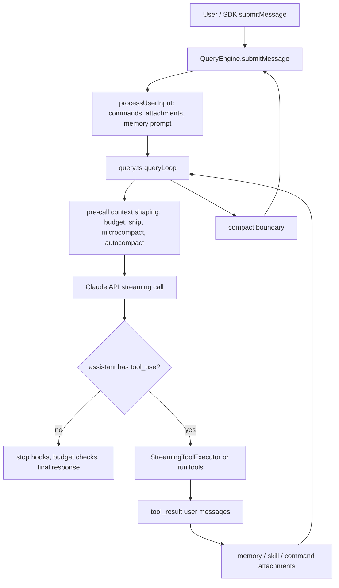
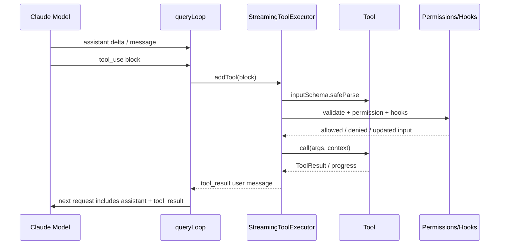
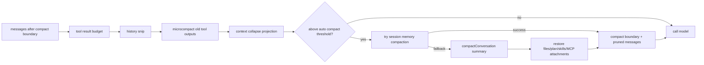
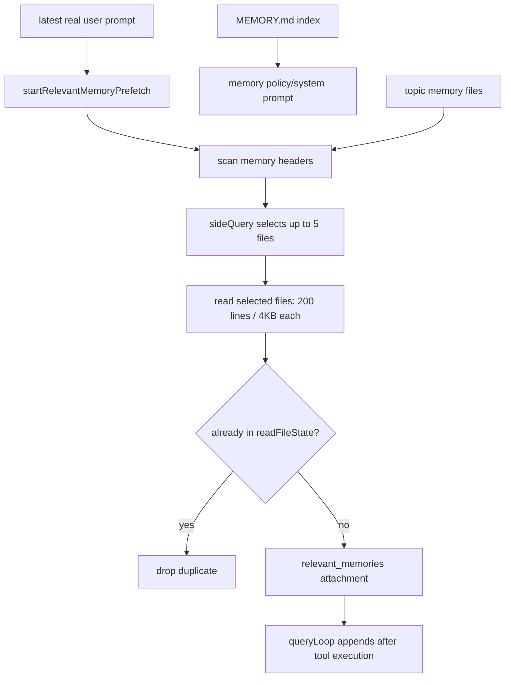

# Claude Code Agent 核心实现分析

分析对象：`/Users/ybd/claude-code`  
日期：2026-07-01  
说明：本文只基于本地源码树做静态分析。该仓库 `package.json` 标注为非官方泄露源码，因此结论应视为对这份本地代码的工程解读，而不是 Anthropic 官方实现承诺。

## 结论

这份 Claude Code 的 agent 不是一个“LLM 调一次工具再返回”的简单循环，而是一个围绕长会话构建的状态机：

1. `QueryEngine` 是 SDK/headless 会话外壳，负责会话消息、文件缓存、权限包装、transcript 持久化和最终 SDK 事件输出。
2. 真正的 agent loop 在 `src/query.ts`，它每一轮都会做上下文裁剪/压缩、调用模型、收集 `tool_use`、执行工具、把 `tool_result` 塞回消息，然后继续下一轮。
3. 工具系统是 schema 驱动的 `Tool` 接口，每个工具声明输入 schema、权限检查、并发安全性、只读/破坏性等属性；执行层有普通批处理和流式提前执行两套路径。
4. 上下文压缩是多层机制：tool result budget、history snip、microcompact、auto compact、reactive compact、manual `/compact`、session memory compaction。完整 compact 不是只生成摘要，还会恢复文件、plan、skills、MCP 指令等工作状态。
5. 记忆分两类：`CLAUDE.md`/规则类 instruction memory，以及 `MEMORY.md` + topic files 的文件型 auto memory。相关 memory 会用 side query 选择，作为 attachment 注入，而不是无脑塞满系统提示词。

## 总览图



## 核心文件地图

| 模块 | 关键文件 | 作用 |
|---|---|---|
| 会话外壳 | `/Users/ybd/claude-code/src/QueryEngine.ts` | SDK/headless lifecycle、消息数组、transcript、usage、compact boundary 输出 |
| 主循环 | `/Users/ybd/claude-code/src/query.ts` | agent loop、模型调用、工具递归、压缩、stop hook、budget |
| Claude API | `/Users/ybd/claude-code/src/services/api/claude.ts` | 把消息、system prompt、tools 转成 API streaming 请求 |
| 工具接口 | `/Users/ybd/claude-code/src/Tool.ts` | 所有工具实现的统一 interface |
| 工具注册 | `/Users/ybd/claude-code/src/tools.ts` | base tools、feature-gated tools、deny rule 过滤 |
| 工具编排 | `/Users/ybd/claude-code/src/services/tools/toolOrchestration.ts` | 普通 tool_use 批处理、并发/串行分组 |
| 流式工具执行 | `/Users/ybd/claude-code/src/services/tools/StreamingToolExecutor.ts` | tool_use 一边流出一边开跑工具 |
| 单工具执行 | `/Users/ybd/claude-code/src/services/tools/toolExecution.ts` | schema 校验、权限、hooks、实际 call |
| 自动压缩 | `/Users/ybd/claude-code/src/services/compact/autoCompact.ts` | compact 阈值、熔断、自动触发 |
| 完整压缩 | `/Users/ybd/claude-code/src/services/compact/compact.ts` | summary agent、边界消息、恢复附件 |
| 微压缩 | `/Users/ybd/claude-code/src/services/compact/microCompact.ts` | 清理旧 tool result 内容 |
| 自动记忆 | `/Users/ybd/claude-code/src/memdir/memdir.ts` | `MEMORY.md` 策略、auto/team/KAIROS memory prompt |
| 记忆召回 | `/Users/ybd/claude-code/src/memdir/findRelevantMemories.ts` | 扫描 memory header，用 Sonnet side query 选相关文件 |
| 记忆附件 | `/Users/ybd/claude-code/src/utils/attachments.ts` | memory 文件读取、截断、预取、去重、attachment 注入 |
| 子 agent | `/Users/ybd/claude-code/src/tools/AgentTool/runAgent.ts` | 子 agent 基于同一个 `query()` 递归跑 sidechain |
| 子 agent memory | `/Users/ybd/claude-code/src/tools/AgentTool/agentMemory.ts` | agent 类型维度的 user/project/local memory |

## 1. Agent Loop

### 1.1 `QueryEngine`：会话级外壳

`QueryEngine` 的源码注释非常明确：一个 `QueryEngine` 对应一个 conversation，每次 `submitMessage()` 是同一 conversation 的一个 turn，消息、文件缓存、usage 会跨 turn 保留。位置：`/Users/ybd/claude-code/src/QueryEngine.ts:175`。

它维护的核心状态包括：

- `mutableMessages`：会话消息数组。
- `abortController`：控制当前 turn 和工具执行取消。
- `readFileState`：已读文件缓存，用于恢复上下文和去重。
- `loadedNestedMemoryPaths`：nested memory 加载去重。
- `totalUsage`：累计 usage。

关键短片段：

```ts
export class QueryEngine {
  private mutableMessages: Message[]
  private abortController: AbortController
  private readFileState: FileStateCache
}
```

来源：`/Users/ybd/claude-code/src/QueryEngine.ts:184`

`submitMessage()` 前半段会构建系统提示词、用户上下文、工具上下文、处理输入 attachments；后半段进入：

```ts
for await (const message of query({ ... })) {
  // Record assistant, user, and compact boundary messages
}
```

来源：`/Users/ybd/claude-code/src/QueryEngine.ts:675`

当 `query.ts` 产生 compact boundary 时，`QueryEngine` 会把 compact 前的消息从 `mutableMessages` 里删掉，释放内存并避免后续继续携带旧历史。位置：`/Users/ybd/claude-code/src/QueryEngine.ts:918`。

### 1.2 `query.ts`：真正的递归状态机

`queryLoop()` 的主循环从 `while (true)` 开始，位置：`/Users/ybd/claude-code/src/query.ts:306`。每次循环处理的是一个“模型调用 + 可选工具结果”的 round。

进入循环前，它会启动 relevant memory 预取：

```ts
using pendingMemoryPrefetch = startRelevantMemoryPrefetch(
  state.messages,
  state.toolUseContext,
)
```

来源：`/Users/ybd/claude-code/src/query.ts:301`

这个设计很漂亮：memory selection 是一个 side query，代码让它和主模型 streaming、工具执行并行发生，后面如果已经完成就消费，没完成就不阻塞当前 turn。

每轮大致顺序：

1. 取 compact boundary 之后的消息：`getMessagesAfterCompactBoundary(messages)`。
2. 应用 tool result budget，避免单条工具结果无限膨胀。
3. 可选 history snip。
4. 执行 microcompact。
5. 可选 context collapse。
6. 检查 autocompact。
7. 调用模型 streaming API。
8. 收集 assistant message 和 `tool_use` blocks。
9. 如果没有工具调用，跑 stop hooks / token budget / recovery，然后结束。
10. 如果有工具调用，执行工具、产出 `tool_result`，再把它们拼回 `state.messages` 继续循环。

关键状态转移在末尾：

```ts
const next: State = {
  messages: [...messagesForQuery, ...assistantMessages, ...toolResults],
  transition: { reason: 'next_turn' },
}
state = next
```

来源：`/Users/ybd/claude-code/src/query.ts:1715`

这就是核心 agent loop：`assistant tool_use -> user tool_result -> next API turn`。

### 1.3 模型 streaming 与工具提前执行

模型调用在 `deps.callModel(...)` 的 async iterator 中进行，位置：`/Users/ybd/claude-code/src/query.ts:659`。当 streaming 中出现 `tool_use` block，会立刻交给 `StreamingToolExecutor.addTool()`：

```ts
for (const toolBlock of msgToolUseBlocks) {
  streamingToolExecutor.addTool(toolBlock, message)
}
```

来源：`/Users/ybd/claude-code/src/query.ts:841`

这意味着一些工具可以在模型回答还没完全流完时先跑起来，降低端到端延迟。但代码也处理 streaming fallback：如果流式尝试失败并切换 fallback，会 tombstone 掉孤立消息，并 discard 正在跑的 streaming tool executor。相关逻辑在 `/Users/ybd/claude-code/src/query.ts:712`。

## 2. Tools 实现

### 2.1 Tool interface

所有工具都实现 `Tool` 类型。它不只是一个 `call()`，还包括输入 schema、并发安全、只读/破坏性、权限、显示、prompt、结果大小等元信息。

核心片段：

```ts
call(args, context, canUseTool, parentMessage, onProgress?)
readonly inputSchema: Input
isConcurrencySafe(input): boolean
checkPermissions(input, context)
```

来源：`/Users/ybd/claude-code/src/Tool.ts:379`

这个接口把工具拆成几层：

- `inputSchema`：先做结构化参数校验。
- `validateInput()`：工具自己的语义校验。
- `checkPermissions()`：工具自身权限判断。
- `canUseTool`：上层统一权限策略和用户批准。
- `isConcurrencySafe()`：调度器决定能不能并行。
- `isReadOnly()` / `isDestructive()`：UI、权限、风险判断。
- `maxResultSizeChars`：超大结果落盘或截断策略。

### 2.2 工具注册

基础工具从 `getAllBaseTools()` 统一列出，位置：`/Users/ybd/claude-code/src/tools.ts:193`。里面包括：

- `AgentTool`
- `TaskOutputTool`
- `BashTool`
- `GlobTool` / `GrepTool`
- `FileReadTool`
- `FileEditTool`
- `FileWriteTool`
- `NotebookEditTool`
- `WebFetchTool`
- `TodoWriteTool`
- `WebSearchTool`
- `AskUserQuestionTool`
- `SkillTool`
- feature-gated 的 browser、LSP、worktree、workflow、MCP resource tools 等

工具最终还会经过 deny rule 过滤，见 `/Users/ybd/claude-code/src/tools.ts:262`。

### 2.3 工具执行链路

普通非流式路径在 `runTools()`：

```ts
for (const { isConcurrencySafe, blocks } of partitionToolCalls(...)) {
  if (isConcurrencySafe) { ... } else { ... }
}
```

来源：`/Users/ybd/claude-code/src/services/tools/toolOrchestration.ts:26`

`partitionToolCalls()` 会把连续的 concurrency-safe 工具合并成一批并行跑；遇到非并发安全工具则单独串行跑。默认最大并发由 `CLAUDE_CODE_MAX_TOOL_USE_CONCURRENCY` 控制，未设置时是 10，见 `/Users/ybd/claude-code/src/services/tools/toolOrchestration.ts:8`。

流式路径在 `StreamingToolExecutor`，它维护：

- `queued`
- `executing`
- `completed`
- `yielded`

并且保证“并发安全工具可以一起跑，非并发工具独占”。类注释在 `/Users/ybd/claude-code/src/services/tools/StreamingToolExecutor.ts:34`。

### 2.4 工具时序图



## 3. 上下文压缩

### 3.1 触发点

每次模型调用前，`query.ts` 会先做上下文处理。关键位置：

- tool result budget：`/Users/ybd/claude-code/src/query.ts:379`
- history snip：`/Users/ybd/claude-code/src/query.ts:401`
- microcompact：`/Users/ybd/claude-code/src/query.ts:414`
- context collapse：`/Users/ybd/claude-code/src/query.ts:440`
- autocompact：`/Users/ybd/claude-code/src/query.ts:454`

### 3.2 microcompact

`microCompact.ts` 不是总结整段对话，而是针对老的工具结果做内容清理。可 compact 的工具包括 Read、Bash、Grep、Glob、WebSearch、WebFetch、Edit、Write 等，见 `/Users/ybd/claude-code/src/services/compact/microCompact.ts:40`。

这个层级很适合 CLI agent，因为工具输出常常是上下文膨胀的主要来源，尤其是 grep、cat、build log。

### 3.3 autocompact 阈值

自动压缩阈值不是直接等于模型 context window，而是先给 summary 输出预留空间：

```ts
const MAX_OUTPUT_TOKENS_FOR_SUMMARY = 20_000
return contextWindow - reservedTokensForSummary
```

来源：`/Users/ybd/claude-code/src/services/compact/autoCompact.ts:28`

默认 auto compact buffer 是 13,000 tokens，warning/error buffer 是 20,000，manual compact buffer 是 3,000，见 `/Users/ybd/claude-code/src/services/compact/autoCompact.ts:62`。

`autoCompactIfNeeded()` 还有熔断器：连续失败 3 次后停止自动压缩，避免 irrecoverable prompt-too-long 场景疯狂烧 API。位置：`/Users/ybd/claude-code/src/services/compact/autoCompact.ts:257`。

### 3.4 完整 compact

完整 compact 在 `compactConversation()`，流程是：

1. 执行 `PreCompact` hooks。
2. 构造 compact prompt。
3. 调 `streamCompactSummary()` 生成摘要。
4. 如果 compact 请求本身 prompt-too-long，则从头截断历史并重试，最多 3 次。
5. 清空 `readFileState` 和 nested memory 路径缓存。
6. 生成 post-compact 附件：最近文件、async agent、plan、plan mode、skills、deferred tools、agent listing、MCP instructions、session start hooks。
7. 创建 compact boundary。
8. 产出 summary message 和附件。

关键顺序由 `buildPostCompactMessages()` 固定：

```ts
return [
  result.boundaryMarker,
  ...result.summaryMessages,
  ...(result.messagesToKeep ?? []),
  ...result.attachments,
  ...result.hookResults,
]
```

来源：`/Users/ybd/claude-code/src/services/compact/compact.ts:330`

完整 compact 最核心的工程点不是“摘要”，而是摘要后恢复上下文。代码在 `/Users/ybd/claude-code/src/services/compact/compact.ts:517` 开始保存旧文件状态，然后在 `/Users/ybd/claude-code/src/services/compact/compact.ts:531` 并行生成恢复附件。

### 3.5 压缩图



## 4. Memory 实现

### 4.1 `CLAUDE.md` 和 auto memory 是两套东西

`src/utils/claudemd.ts` 处理 `CLAUDE.md`、`.claude/CLAUDE.md`、`.claude/rules/*.md` 这类 instruction memory。`getClaudeMds()` 会把不同来源的 memory file 转成 prompt 内容，位置：`/Users/ybd/claude-code/src/utils/claudemd.ts:1153`。

`src/memdir/memdir.ts` 处理自动记忆目录，核心入口文件叫 `MEMORY.md`。它把 `MEMORY.md` 定位成索引，而不是内容仓库：详细记忆应写入 topic file，再在 `MEMORY.md` 放一行 pointer。相关规则生成在 `/Users/ybd/claude-code/src/memdir/memdir.ts:199`。

### 4.2 `MEMORY.md` 的限流

`MEMORY.md` 会被截断到最多 200 行和 25KB，见 `/Users/ybd/claude-code/src/memdir/memdir.ts:36`。这是为了让索引常驻上下文，但不会被无限写大。

自动 memory prompt 的加载逻辑在 `loadMemoryPrompt()`：

- KAIROS daily-log 模式优先。
- TEAMMEM 开启时加载 private + team memory。
- 普通 auto memory 开启时确保目录存在，然后返回 memory 行为策略。
- 关闭时返回 `null`。

位置：`/Users/ybd/claude-code/src/memdir/memdir.ts:420`。

### 4.3 相关 memory 召回

memory 召回不是把所有 topic files 注入，而是：

1. 扫描 memory 文件 header。
2. 用 side query 让 Sonnet 挑最多 5 个相关文件。
3. 读取这些文件的前 200 行且每个最多 4KB。
4. 作为 `relevant_memories` attachment 注入。
5. 根据 `readFileState` 去重，避免工具已经读过的文件重复注入。

选择逻辑在 `/Users/ybd/claude-code/src/memdir/findRelevantMemories.ts:39`。文件读取和截断在 `/Users/ybd/claude-code/src/utils/attachments.ts:2279`。

相关 memory 的 per-file 限制：

```ts
const MAX_MEMORY_LINES = 200
const MAX_MEMORY_BYTES = 4096
MAX_SESSION_BYTES: 60 * 1024
```

来源：`/Users/ybd/claude-code/src/utils/attachments.ts:269`

预取入口：

```ts
export function startRelevantMemoryPrefetch(...)
```

来源：`/Users/ybd/claude-code/src/utils/attachments.ts:2361`

去重入口：

```ts
export function filterDuplicateMemoryAttachments(...)
```

来源：`/Users/ybd/claude-code/src/utils/attachments.ts:2520`

### 4.4 Memory 图



## 5. Subagent 与 AgentTool

`AgentTool` 不是单独实现一套 agent loop，而是在 `runAgent.ts` 里复用主 `query()`。文件开头直接 import 了 `query`，见 `/Users/ybd/claude-code/src/tools/AgentTool/runAgent.ts:15`。

子 agent 会有自己的：

- agent id
- sidechain transcript
- agent-specific MCP servers
- resolved tools
- agent memory
- cleanup lifecycle

agent memory 有 user/project/local 三种 scope：

- user：`<memoryBase>/agent-memory/<agentType>/`
- project：`<cwd>/.claude/agent-memory/<agentType>/`
- local：`<cwd>/.claude/agent-memory-local/<agentType>/`

来源：`/Users/ybd/claude-code/src/tools/AgentTool/agentMemory.ts:46`。

## 6. 对 Cardputer Zero / Rust Agent 的启发

如果要在资源受限设备上实现一个调用云端模型 API 的 agent，我会借鉴这份设计的“形状”，但大幅简化：

1. Agent loop 可以保留同样的状态机：`model -> tool_use -> tool_result -> model`。这是最核心的骨架。
2. 工具接口建议用 Rust trait 表达：
   - `name()`
   - `schema()`
   - `validate()`
   - `permission()`
   - `is_concurrency_safe()`
   - `call()`
3. 压缩不要一开始就做完整复杂体系。先做三层即可：
   - 工具输出截断和落盘。
   - 最近 N 轮保留。
   - 超阈值后调用云端 summary compact。
4. memory 用文件型索引很适合小设备：
   - 一个 `MEMORY.md` 索引。
   - 多个 topic `.md` 文件。
   - 每次只召回少量相关文件。
5. 对 Cardputer Zero 这种设备，复杂的 side query、并发 streaming tool executor、MCP、子 agent 都可以先放到云端代理或边缘网关，小设备只负责唤醒、录音、显示、少量本地工具和网络请求。

一个可落地的最小 Rust 结构：

```rust
struct AgentState {
    messages: Vec<Message>,
    memory_index: MemoryIndex,
    tools: Vec<Box<dyn Tool>>,
    compact_threshold_tokens: usize,
}
```

```rust
trait Tool {
    fn name(&self) -> &'static str;
    fn is_concurrency_safe(&self) -> bool;
    async fn call(&self, input: serde_json::Value, ctx: ToolContext)
        -> anyhow::Result<ToolResult>;
}
```

真正需要保留的是 Claude Code 这几个设计原则：

- tool schema 和权限逻辑必须在本地执行层兜底，不能只信模型。
- 压缩后要恢复工作状态，否则摘要会让 agent “忘记自己正在干嘛”。
- memory 应该是检索式注入，不应该全量常驻。
- 每个循环都要有 max turns、abort、预算、错误恢复，否则 agent 很容易失控。

## 7. 我对这套实现的评价

优点：

- 状态边界清楚：`QueryEngine` 管会话，`query.ts` 管 loop，tools 管能力，compact 管上下文生命周期。
- 工具系统工程化程度很高：schema、权限、hooks、并发、安全属性、结果大小都在统一接口里。
- compact 做得很现实：不仅关心 token，还关心恢复文件、plan、skills、MCP 等继续工作所需的上下文。
- memory 设计比“长 prompt 里塞一切”稳健，尤其是 `MEMORY.md` 作为索引、topic files 作为内容的拆分。

代价：

- 复杂度很高，feature flags 和实验路径很多，移植成本大。
- `query.ts` 承担职责过重：模型调用、compact、tool execution、memory prefetch、hooks、budget 都在同一个大循环里。
- 对小设备不友好：这套实现默认是在桌面/服务器级运行时里工作，不适合作为 Cardputer Zero 上的完整本地 runtime。

我的结论：如果你的目标是在 Cardputer Zero 上做一个“喊醒后调用云端大模型的 agent”，不要照搬 Claude Code；应该照搬它的状态机和边界设计，把重逻辑放到云端或手机/电脑网关，小设备只保留唤醒、音频、网络、显示和少数本地工具。

